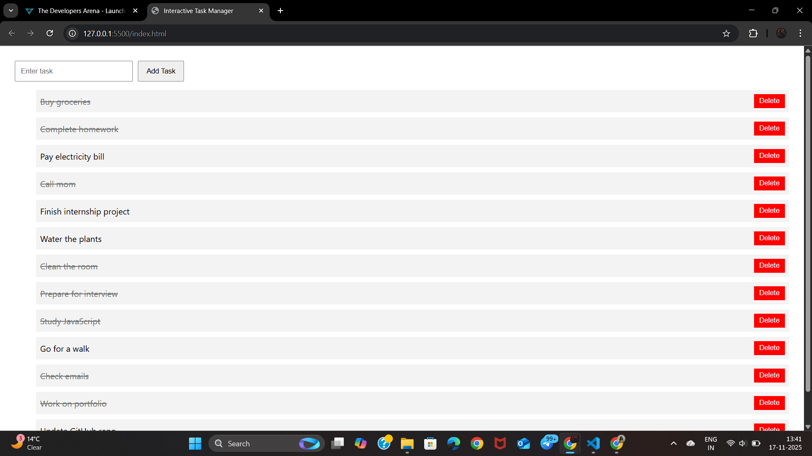

<h1 align="center">📝 Interactive Task Manager (Week 3 Project)</h1>

<p align="center"> 
   
   
   
</p> 

<p align="center"> A clean and interactive <b>Task Manager Application</b> developed as part of my <b>Week 3 Internship Project</b>. 
  This project includes task creation, deletion, marking tasks as complete, and real-time UI updates using JavaScript. </p>

---

## 🚀 Live Demo
🔗 **View Project:** [📝 Interactive Task Manager (Week 3 Project)](https://saicharanjanagama.github.io/Intern-Week3/)

📸 **Preview:**

<p align="center">
  
</p> 

---

## 🎯 Features

- ➕ Add New Tasks Easily
- ✔️ Mark Tasks as Completed (Interactive toggle effect)
- ❌ Delete Any Task Individually
- 📱 Fully Responsive UI
- 🎨 Clean, Minimal & Modern Design
- ⚡ Smooth interactions using JavaScript
- 🗂️ Task list updates in real-time  

---

## 🛠️ Technologies Used

- **HTML5**
- **CSS3**
- **JavaScript**
- **System Font Stack**
*(Windows → Segoe UI, macOS → San Francisco, Android → Roboto)*
- **Responsive Layout**

---

## 🚀 How to View

To view the project locally:  
```bash
open index.html
```
---

## 👨‍💻 Author

It’s me — **Sai Charan Janagama** 😄<br>
🎓 Computer Science Graduate | 🌐 Aspiring Full Stack Developer<br>
📧 [Email Me](saic89738@gmail.com) ↗<br>
🔗 [LinkedIn](https://www.linkedin.com/in/saicharanjanagama/) ↗<br>
💻 [GitHub](https://github.com/SaiCharanJanagama) ↗

---

## 💬 Feedback

If you have any feedback or suggestions, feel free to reach out!  
Your input helps me improve 🚀
